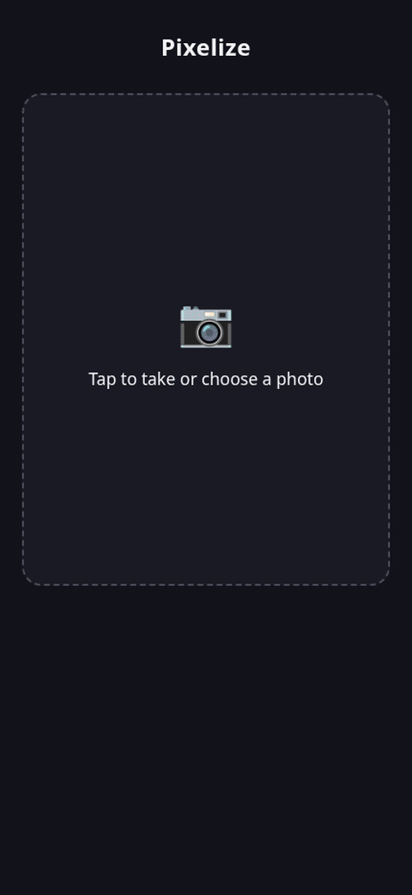
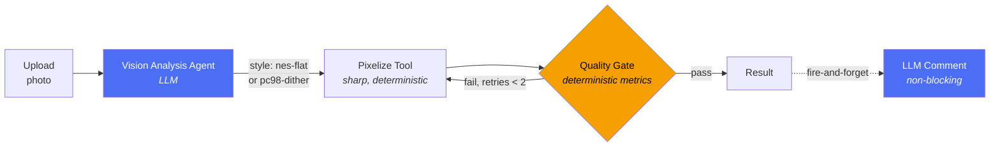
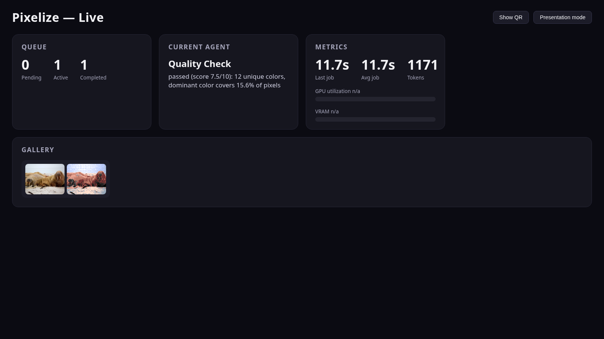
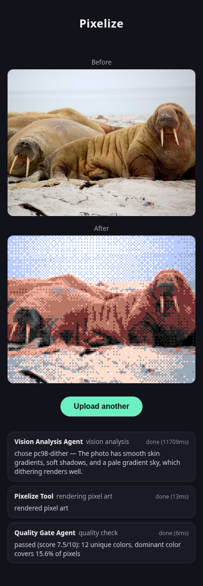

# Pixelize

**A photo-to-pixel-art pipeline that shows its work.** An LLM agent looks at your photo, decides how to render it, a deterministic tool does the rendering, and a quality gate checks (and retries) the result — every decision streamed live to a dashboard.




## What is this

Most "agentic AI" demos are a single LLM call wearing a trench coat. Pixelize is built to prove the opposite: a real pipeline with **two independent LLM decisions**, a **deterministic rendering tool**, and a **deterministic quality gate that can trigger retries** — with every step, input, output, and decision written to a trace store and streamed to a live dashboard so nothing is a black box.

Upload a photo from your phone, and watch an agent decide how to turn it into pixel art, render it, grade its own output, and retry if the result doesn't meet the bar — all running on local models, no cloud API calls.

## Pipeline



1. **Vision Analysis Agent** — a vision-capable LLM looks at the uploaded photo and decides which pixel-art style fits best (`nes-flat` flat-color nearest-match, or `pc98-dither` ordered dithering for gradients), returning structured JSON with its reasoning.
2. **Pixelize Tool** — a deterministic `sharp`-based renderer applies the chosen style using a canonical palette loaded from disk (never from model memory). Runs with `sharp.concurrency(1)` for reproducible output.
3. **Quality Gate** — deterministic image metrics (color histogram, palette-color coverage, banding detection) decide pass/fail. A failed result triggers an automatic retry with adjusted parameters, up to 2 times.
4. **LLM Comment** *(optional)* — a short human-readable description of the result is generated in parallel and streamed to the dashboard. It never blocks the response.

Every one of these steps — inputs, outputs, timings, and the agent's reasoning — is written to a trace store and visible on the live dashboard, down to the individual job.

## Screenshots

**Live dashboard** — queue state, the agent's current decision, token/timing metrics, and a rolling result gallery, all pushed over Server-Sent Events:



**Before / after** — the mobile upload page after a job completes, with the full agent trace underneath:



## Tech Stack

| Component        | Technology                          |
|-------------------|--------------------------------------|
| Backend           | NestJS + TypeScript (strict)         |
| Queue             | BullMQ                               |
| Cache / broker    | Redis                                |
| Frontend          | React + Vite + TypeScript            |
| Realtime          | Server-Sent Events (SSE)             |
| LLM runtime       | Ollama (local, vision-capable model) |
| Image processing  | sharp                                |
| GPU metrics       | `nvidia-smi` (parsed)                |
| Containerization  | Docker Compose                       |

## Quick Start

**Requirements:**
- Docker + Docker Compose
- [Ollama](https://ollama.com) running on the host with a vision-capable model pulled (e.g. `qwen3.8:27b`, or any vision/tool-capable model of your choice)

```bash
cp .env.example .env
# edit .env: set OLLAMA_BASE_URL and OLLAMA_MODEL to match your local Ollama setup

docker compose up
```

This starts Redis, the NestJS backend, and the Vite frontend (`network_mode: host`, so the backend can reach Ollama on `localhost`). Open the upload page on your phone (or `http://localhost:5173`) and the dashboard at `http://localhost:5173/dashboard`.

`GET /health` reports `{ status: "ok", ollama: true, redis: true }` once everything is wired up.

## Observability / Trace

Every agent decision — vision analysis reasoning, chosen style, quality gate score, retry cause — is written to a per-job trace store as it happens, not reconstructed after the fact. The dashboard's "Current Agent" panel and each job's step log read directly from that trace, so you can watch the pipeline reason about a specific photo in real time, or inspect it after the fact.

## Battle-tested: 10 concurrent uploads

From [`docs/stress-test-report.md`](docs/stress-test-report.md), a real run against a local `docker compose up` stack:

| Metric | Value |
|---|---|
| Jobs submitted concurrently | 10 |
| Succeeded / Failed / Timed out / Lost | 10 / 0 / 0 / 0 |
| Wall clock (first upload → last job done) | 252.8s (~4.2 min) |
| Avg processing time per job | ~25.3s |
| Quality gate retries fired (and converged) | 4 / 10 jobs |

The queue processes strictly sequentially (`BullMQ` concurrency 1, deliberate — avoids GPU/VRAM contention from concurrent inference calls), and no job was lost or hung even under load.

## License

MIT — see [LICENSE](LICENSE).
